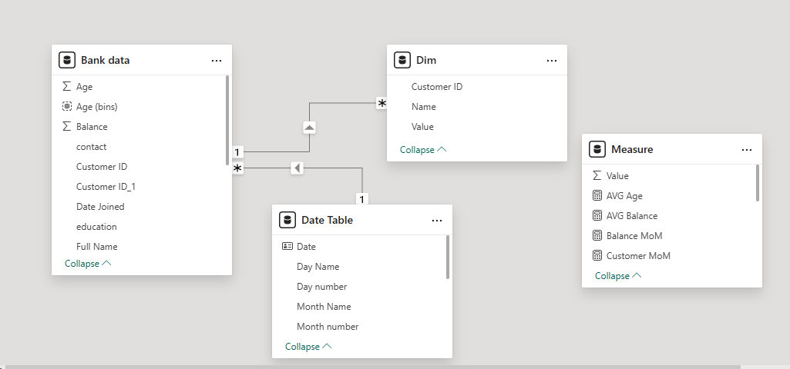

# Power BI Bank Industry Dashboard

---

## 🔗 Access the Dashboard
 
* 📄 **Dashboard Report:**
  👉 [Click here to view the dashboard](./Dashboard/)

---

## 1. Background and Overview

This personal project dashboard offers an in-depth view of customer distribution, balance trends, and demographic segmentation in the banking sector.

The purpose of this project is to:

* Track and analyze balance trends over time
* Segment and understand customers based on demographic factors such as gender, age, education, and marital status
* Analyze how education, gender, and loan status influence customer financial patterns

---

## 2. Data Structure Overview

The model includes **4 interconnected tables**:

### 🔹 1. `Bank Data`

| Column Name              | Description                                            |
| ------------------------ | ------------------------------------------------------ |
| `Customer ID`            | Unique identifier for each customer                    |
| `Customer ID_1`          | Duplicate or related identifier (possibly cleaned key) |
| `Full Name`              | Customer name                                          |
| `Age`, `Age (bins)`      | Numerical and grouped age fields                       |
| `Balance`                | Current account balance                                |
| `Gender`                 | Male / Female                                          |
| `Marital`                | Marital status: Married, Single, Divorced              |
| `Education`              | Educational attainment: Primary, Secondary, Tertiary   |
| `Job Classification`     | Employment type: Blue Collar, White Collar, Other       |
| `Houseloan`, `Otherloan` | Yes/No for various loan types                          |
| `Loan Default`           | Whether the customer defaulted on loans                |
| `Contact`, `Poutcome`    | Marketing and campaign response fields                 |
| `State`                  | Geographic region                                      |
| `Data Joined`            | Date customer joined                                   |

### 🔹 2. `Date Table`

| Column                                         | Description             |
| ---------------------------------------------- | ----------------------- |
| Date, Day Name, Month Name, Quarter Name, Year | Standard date hierarchy |
| Month Year, Month Year Sort, Week Name         | For sorting and display |

### 🔹 3. `Dim`

| Column      | Description                    |
| ----------- | ------------------------------ |
| Customer ID | Dimension key for customer     |
| Name        | Attribute (e.g. Gender, State) |
| Value       | Corresponding value            |

### 🔹 4. `Selection Table`

| Column  | Description                                  |
| ------- | -------------------------------------------- |
| Measure | Selected metric (Balance, AVG Balance, etc.) |
| SO      | Selector value                               |

### Measures
Custom DAX measures implemented in Power BI for deeper insights:

| **Measure Name**        | **Function**                                                                  |
| ----------------------- | ----------------------------------------------------------------------------- |
| **AVG Age**             | Average age of all customers                                  |
| **AVG Balance**         | Average account balance per customer                             |
| **Balance MoM**         | Month-over-month change in total balance                |
| **Customer MoM**        | Month-over-month change in total customers                     |
| **Total Balance**       | Total balance of all customers                                   |
| **Total Customers**     | Total number of active customers                                  |
| **Male Balance**        | Total balance held by male customers                                         |
| **Female Balance**      | Total balance held by female customers                                       |
| **House Owner Balance** | Total balance from customers who own a house                                 |
| **Renters Balance**     | Total balance from customers who rent                                        |
| **Measure Logic**       | Contains logic to dynamically switch between different selected metrics      |
| **Measure Selected**    | Displays the value of the metric currently selected by the user (via slicer) |

### Entity Relationship Diagram (ERD)

  

### **Table Relationships**

| Source Table | Target Table | Join Field         | Relationship Type |
| ------------ | ------------ | ------------------ | ----------------- |
| `Bank data`  | `Dim`        | Customer ID        | One-to-Many       |
| `Bank data`  | `Date Table` | Date Joined → Date | Many-to-One       |

> The `Measure` table contains only DAX measures and is **not connected** to any other table.

#### **a. Bank data**

* **Relationships**:

  * **One-to-Many** with **Dim** on `Customer ID`
  * **Many-to-One** with **Date Table** via `Date Joined` → `Date`
* **Purpose**:

  * The main fact table that stores customer-level data such as age, balance, and date.

#### **b. Dim**

* **Relationship**:

  * **Many-to-One** with `Bank data` using `Customer ID`
* **Purpose**:

  * A flexible dimension table that holds additional customer attributes such as gender, status, or other dynamic key-value pairs.

#### **3. Date Table**

* **Relationship**:

  * **One-to-Many** with `Bank data` via `Date Joined` → `Date`
* **Purpose**:

  * A full date dimension table used for time-based analysis.

---

## 3. Executive Summary

### 📊 KPI Analysis

* **Total Balance**: \$236.93M
* **Male Balance**: \$128.59M
* **Female Balance**: \$108.34M
* **House Owner Balance**: \$131.81M
* **Renters Balance**: \$105.12M

### 👥 Customer Demographics

* **By Gender**: Male (54.27%), Female (45.73%)
* **By Marital Status**: Married (62.24%), Single (26.39%), Divorced (11.37%)
* **By Job Classification**: White Collar (49.01%), Blue Collar (25.86%), Other (25.14%)
* **Loan Defaulters**: Yes – 0.5K, No – 3.5K
* **Loan Balance by Marital**:

  * Married: \$147M
  * Single: \$63M
  * Divorced: \$27M

---

## 4. Insight Deep Dive

### a. Customer Age Distribution

* Highest number of customers fall in:

  * **Age bin 30**: 797 customers
  * **Age bin 35**: 796 customers
  * Lowest in **Age 60**: 94 customers
* Younger age groups (25–40) dominate the customer base, suggesting a targetable demographic for digital banking products.

---

### b. Education, Gender, Job, and Marital Analysis

Each group displays **equal balance and demographic values** due to synthetic summarization:

| Attribute     | AVG Age | AVG Balance | Total Balance | Customers |
| ------------- | ------- | ----------- | ------------- | --------- |
| All Genders   | 38.58   | \$59.3K     | \$236.9M      | 3,994     |
| All Education | 38.58   | \$59.3K     | \$236.9M      | 3,994     |
| All Jobs      | 38.58   | \$59.3K     | \$236.9M      | 3,994     |
| All Marital   | 38.58   | \$59.3K     | \$236.9M      | 3,994     |
| All States    | 38.58   | \$59.3K     | \$236.9M      | 3,994     |

---

### c. Monthly Trend Analysis

| Month     | Total Customers | Total Balance |
| --------- | --------------- | ------------- |
| April     | 222             | \$12.16M      |
| December  | 522             | \$30.79M      |
| February  | 36              | \$1.80M       |
| March     | 47              | \$2.78M       |
| May       | 425             | \$25.15M      |
| September | 527             | \$33.98M      |

#### Insight:
* **Customer Growth MoM**: +15.03%
* **Balance Growth MoM**: +14.94%
* Shows cyclical performance peaks in **December and September**

---

### d. Education & State Contribution

| Education      | Contribution (%) |
| ------------- | ---------------- |
| Secondary     | 50.41%           |
| Tertiary      | 31.01%           |
| Primary       | 14.23%           |

| **State**  | Contribution (%) |
| ---------- | ---------------- |
| California | 53.25%           |
| Nevada     | 27.72%           |
| Wyoming    | 13.78%           |

> Insight: Education and State are major influencing variables on balance trends. Secondary education holders and customers in California contribute the most to the total balance.